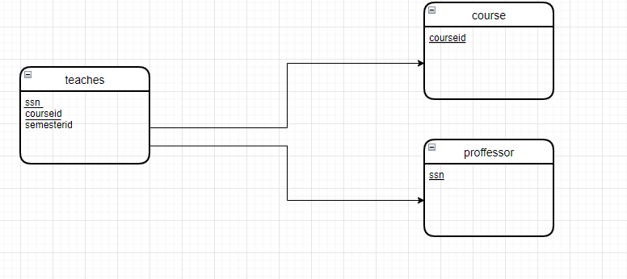
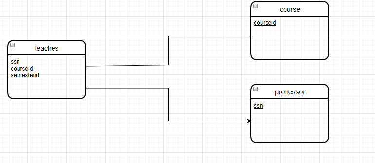
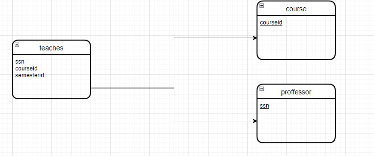
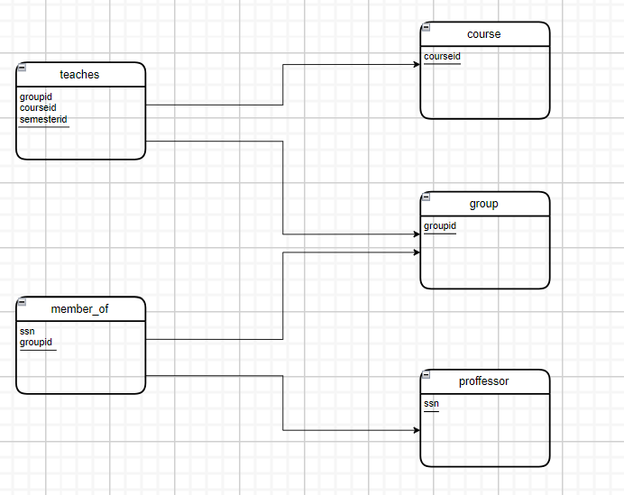

# csi2532_playground

## Lab4

#### Diagramme de relation pour les questions 1, 3, 5, et 6 et le code sql

Avec les diagrammes ER ci-dessus, modèlez un diagramme relationnel pour les systèmes.

## Question 1 


```sql
CREATE TABLE professeurs (
    ssn int,
    PRIMARY KEY (ssn)
);

CREATE TABLE cours (
    courseid int,
    PRIMARY KEY (courseid)
);

CREATE TABLE teaches (
    semester int,
    ssn int,
    courseid int,
    PRIMARY KEY (ssn, courseid),
    FOREIGN KEY (ssn) REFERENCES professeurs,
    FOREIGN KEY (courseid) REFERENCES cours
);
```

## Question 3


```sql
CREATE TABLE professor (
    ssn int,
    PRIMARY KEY (ssn)
);

CREATE TABLE course (
    courseid int,
    PRIMARY KEY (courseid)
);

CREATE TABLE teaches (
    semesterid int,
    ssn int NOT NULL,
    courseid int NOT NULL,
    PRIMARY KEY (ssn, courseid),
    FOREIGN KEY (ssn) REFERENCES professor,
    FOREIGN KEY (courseid) REFERENCES course
);
```

## Question 5 


```sql
CREATE TABLE professor (
    ssn int,
    PRIMARY KEY (ssn)
);

CREATE TABLE course (
    courseid int,
    PRIMARY KEY (courseid)
);

CREATE TABLE teaches (
    semesterid int,
    ssn int,
    courseid int,
    PRIMARY KEY (ssn, courseid),
    FOREIGN KEY (ssn) REFERENCES professor,
    FOREIGN KEY (courseid) REFERENCES course
);
```

## Question 6


```sql
CREATE TABLE professor (
    ssn int,
    PRIMARY KEY (ssn)
);

CREATE TABLE group (
    groupid int,
    PRIMARY KEY (groupid)
);

CREATE TABLE member_of (
    ssn int,
    groupid int,
    FOREIGN KEY (ssn) REFERENCES professor,
    FOREIGN KEY (groupid) REFERENCES group
);

CREATE TABLE course (
    courseid int,
    PRIMARY KEY (courseid)
);

CREATE TABLE teaches (
    semesterid int,
    ssn int,
    courseid int,
    PRIMARY KEY (ssn, courseid),
    FOREIGN KEY (ssn) REFERENCES professor,
    FOREIGN KEY (courseid) REFERENCES course
);
```
